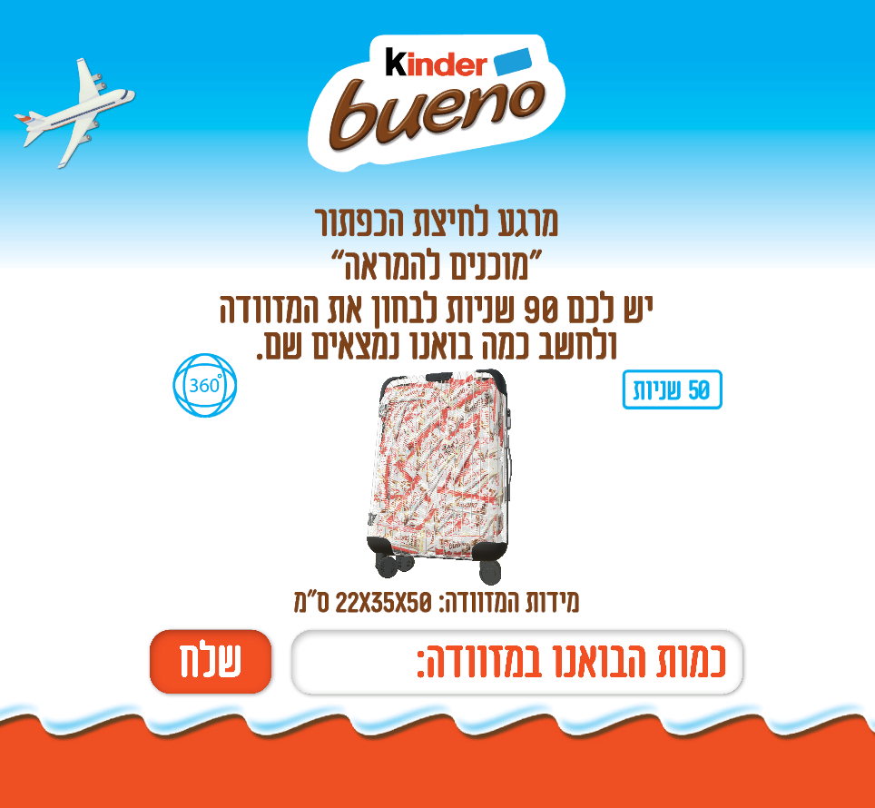
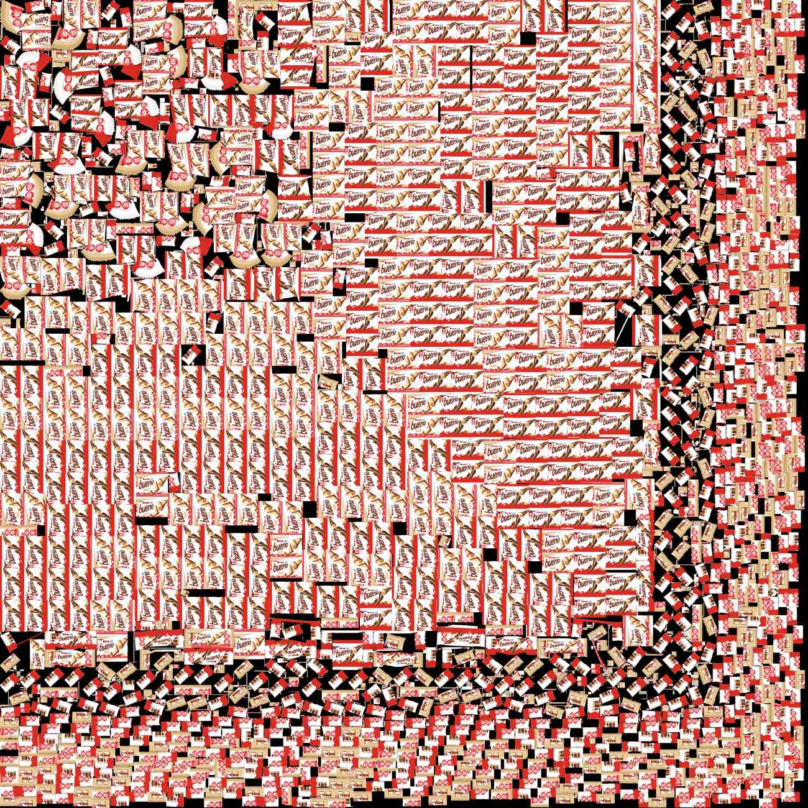
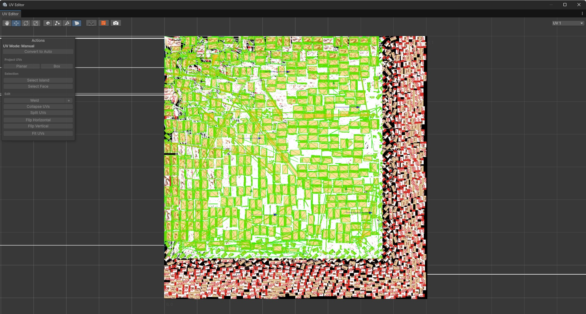
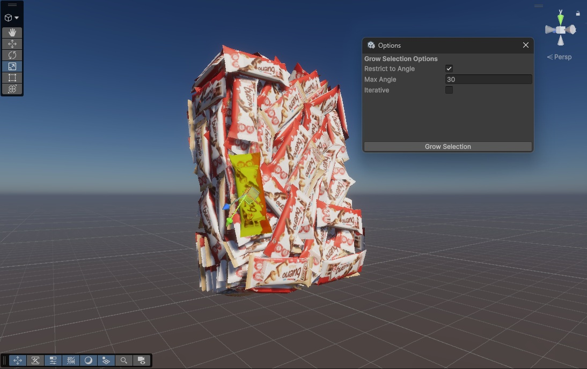

## Executive Summary

What starts as a simple marketing campaign often hides a complex technical implementation. Kinder Israel launched a digital challenge: a 3D transparent suitcase filled with hundreds of Kinder Bueno bars. The goal was to guess the exact count.

Here's the catch: **the challenge appeared for only 90 seconds** in a web app, and the suitcase was a small, freely rotatable 3D object that made visual estimation nearly impossible. Most users relied on guessing or attempting quick mental math on a rotating container. I took a different approach.

I treated the web application as a **compiled binary waiting to be reversed**.

By extracting game assets from a production `.unityweb` bundle, analyzing 3D mesh data in Unity, and simulating human input via AutoHotkey, I transformed a game of luck into a solved equation.

This research demonstrates how distributing authoritative data to an untrusted client enables deterministic exploitation, even when traditional obfuscation techniques are used.


**Research Highlights:**
* **Technical Domain:** Client-side Reverse Engineering / Asset Extraction
* **Tools Used:** Unity, AssetRipper, ProBuilder, AutoHotkey
* **Core Logic:** Bypassing UI abstractions to access the underlying data model
* **Outcome:** Deterministic extraction of the correct answer and automated submission under human-like timing constraints
* **Business Impact**: Loss of contest integrity leading to unfair advantage, reputational damage, and potential financial exposure (prize abuse, campaign credibility).


### Threat Model

- **Attacker capability:** Read-only access to client-delivered assets
- **Trust boundary violated:** Client-side secrecy of authoritative game state
- **Security assumption:** Visual obfuscation prevents deterministic extraction
- **Failure mode:** Static assets revealed complete ground truth

### Scope & Ethics

- Analysis was limited to client-delivered assets and passive inspection.
- No server-side bypass, privilege escalation, or infrastructure impact.

---

## Phase 1: Reconnaissance & Asset Extraction

The challenge was hosted as an interactive 3D environment. Given the 90-second window and the small, freely rotating 3D interface that made visual counting impractical, reverse engineering became the only viable approach.



Initial inspection of the network traffic via Chrome DevTools revealed the backbone of the application: a large `.unityweb` file. This format is a compressed bundle containing the engine's WebAssembly code and, more importantly, the game's global assets (textures, meshes, and scenes).

### Breaking the Bundle
Since `.unityweb` files are obfuscated and compressed for web delivery, they cannot be read directly. I employed a suite of specialized extraction tools: **AssetRipper** for quick inspection and **AssetStudio** to decompile the bundle and reconstruct the original Unity scene hierarchy.

After successful extraction, I had the raw assets. I imported the reconstructed scene into a local Unity environment to begin the deep analysis.

---

## Phase 2: From Raw Assets to Accurate Count

### Step 1: Inspecting the Raw Assets

After successful decompilation, I imported the reconstructed scene into a local Unity environment. Upon opening the scene, I encountered my first hurdle: the developers had anticipated simple object counting. Instead of individual candy bar objects, all Kinder bars were merged into a **single inseparable 3D mesh block**.


### Step 2: The Texture Atlas Discovery

While exploring the extracted assets, I discovered a massive texture atlas containing hundreds of chocolate bar images. This was my "aha" moment—perhaps the answer was simpler than I thought.

**First Assumption: Just Count the Atlas**

My initial instinct was straightforward: if the atlas contains all the bars, I could just count them manually. I opened the texture file and began tallying each chocolate bar image. 

However, manually counting hundreds of small objects in an image is nearly impossible without losing track. To solve this, I used **DotDotGoose**—a researcher's tool specifically designed for counting objects in images by manually placing markers. I also cross-validated the count using AI-powered image analysis to ensure accuracy.

As I examined the atlas more carefully, I noticed something interesting: the bars came in two varieties—**brown (original) and white (white chocolate)**. Since each physical Kinder Bueno bar has two sides, I realized I could perform a sanity check: the total number of white bar textures must be even, and the total number of brown bar textures must also be even. If I found an odd count for either variant, it would indicate a bar with only one side—which could indicate unused assets or intentionally misleading content.

The brown variant count was even, while the white variant count was odd. An odd count does not imply deception per se, but it strongly suggests the atlas is not a one-to-one representation of instantiated objects.



### Step 3: UV Mapping Investigation

Instead of trusting the atlas count, I needed to understand the relationship between the texture and the 3D geometry. I turned to Unity's **UV editor** to see how these textures were actually wrapped around the mesh. 

The UV mapping revealed that not every bar in the atlas was necessarily used in the final 3D model—some could be unused assets, duplicates, or red herrings. The atlas was simply a resource library, not a direct representation of the suitcase contents.



### Step 4: Validation with ProBuilder & Manual Counting

With the UV mapping understood, I needed a systematic way to count the actual 3D geometry. Counting the geometry itself is the safest method because the mesh is the ground truth—texture atlases can include unused, duplicated, or decoy assets. I integrated **ProBuilder** into my Unity workflow to enable precise mesh manipulation and selection.

**The Grow Selection Technique**

I used ProBuilder's **'Grow Selection'** technique to programmatically identify and select all faces belonging to a single Kinder Bueno bar. The challenge was finding the right threshold to avoid selecting adjacent bars while capturing all faces of a single bar.

Through experimentation, I discovered the sweet spot: expanding the selection to include only adjacent faces within a **30-degree angle tolerance**. This prevented the selection from "bleeding" across bars while ensuring complete coverage of each individual bar.




**Physical Validation: The "Sanity Check"**

Before submitting my final answer, I needed one more layer of validation. I knew the suitcase dimensions from the challenge description: **22×35×50 cm**. To validate my count against physical reality, I went to a store and bought an actual Kinder Bueno bar to measure it precisely: **12×4.5×2 cm**.

Using these measurements, I calculated the theoretical maximum capacity of the suitcase:

$$\text{Max Bars} = \frac{22 \times 35 \times 50}{12 \times 4.5 \times 2} \approx 356$$

This is a **volume-only upper bound** (it ignores real-world packing efficiency, orientation constraints, and void space), so the true physical maximum is almost certainly lower. I used it purely as a sanity check: my final answer had to be $\le 356$, otherwise it would be physically impossible.


---

## Phase 3: The "Last Mile" - Automation & Simulation

Knowing the exact number was only half the battle; the contest rewarded speed. To ensure a winning submission, I moved from researcher to automation engineer.

### UI Automation with AutoHotkey (AHK)

I developed an AHK script to automate the submission process. However, a "blazing fast" submission (e.g., 10ms) would be a clear indicator of bot activity. To stay under the radar, I:
* **Simulated Human Latency:** Randomized the delay between keystrokes.
* **Pixel-Perfect Targeting:** Automated the focus and click events to bypass UI lag.

```autohotkey
; Automated Submission Primitive
ControlClick, x500 y400, KinderChallengeWindow
Sleep, % Rand(150, 300) ; Simulate human reaction time
SendRaw, %ExactCandyCount%
Send, {Enter}
```

## Defensive Recommendations

- Do not ship authoritative counts or deterministic layouts to the client
- Perform server-side validation of contest answers
- Randomize or generate client visuals independently of ground truth
- Treat WebGL / Unity assets as fully public

---

## Lessons Learned

This project was a masterclass in resourcefulness. It demonstrated that:

* **Obfuscation is not a Security Boundary:** Visual abstraction and mesh merging increased effort but did not change exploitability for a determined attacker.
* **The Client is Unatrusted:** Any data sent to the client (even in a compiled Unity bundle) should be considered public.
* **Holistic Thinking:** Success required jumping between 3D modeling, network analysis, and automation scripting.

The "sweetest" victory wasn't the chocolate—it was the thrill of the reverse.

---

Interested in how I break complex systems? [Let's connect on LinkedIn](https://www.linkedin.com/in/rony-utevsky/).