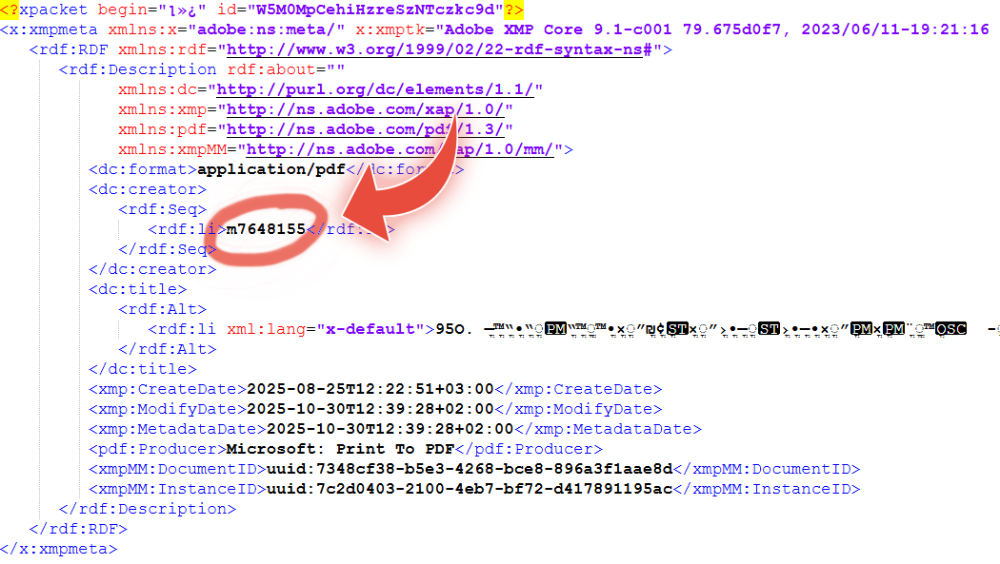

Six years after a brief interaction with a translation firm, I unexpectedly received a "home assignment" from them. My professional focus has long since shifted to cybersecurity, but my intuition kicked in when I saw the nature of the files they were distributing. What was meant to be a routine skills test turned out to be a massive leak of classified IDF documents.

### The "Uncensoring" Process
This wasn't a complex cyber exploit, but a textbook example of a **redaction failure**. The documents—labeled "Top Secret" and detailing ground maneuver protocols in Gaza from March 2024—appeared to have sensitive portions covered by black bars.

However, instead of permanently "flattening" the document to remove the underlying data, the sender had merely placed a vector-based black layer over the text. Using a basic PDF editor, I was able to simply select and delete the black boxes, revealing the original classified content in its entirety.

### Technical Deep Dive: Metadata & Forensics
Beyond the visual redaction failure, I inspected the PDF’s metadata to understand the origin of the leak. I identified the account recorded as responsible for the redaction: `m7648155`. In the context of IDF systems, the “m” prefix typically indicates *Miluim* (reserve duty), followed by the soldier’s *Mispar Ishi* (personal service ID).

### Why This Matters
The vulnerability was twofold:
* **Technical Failure**: Improper digital sanitization left sensitive data retrievable by anyone with a mouse and a PDF viewer.
* **Process Failure**: The company, BLEND, was distributing these documents to unvetted job candidates who had not undergone security clearances.

### Broader Scope
This document is likely just the tip of the iceberg. The company has reportedly been working with the IDF for over two years, and if this sample was distributed in such a poorly redacted state, it’s reasonable to assume many other documents may have been handled similarly. The potential leakage could therefore be significantly larger than the single file I uncovered.

### Responsible Disclosure
After realizing the severity of the breach, I attempted to report the leak to the Israel Police, the Ministry of National Security, and the National Cyber Directorate. When these channels failed to provide an immediate fix, I contacted **YNET** to ensure the public interest was protected and the leak was plugged.

**Impact of the Disclosure:**
* **Urgent Recall**: The company issued an immediate "delete" order to all candidates regarding the files.
* **Official Investigation**: The IDF spokesperson confirmed that the incident is currently being investigated.

**[Read the full report on YNET →](https://www.ynet.co.il/news/article/bjne117yybe)**