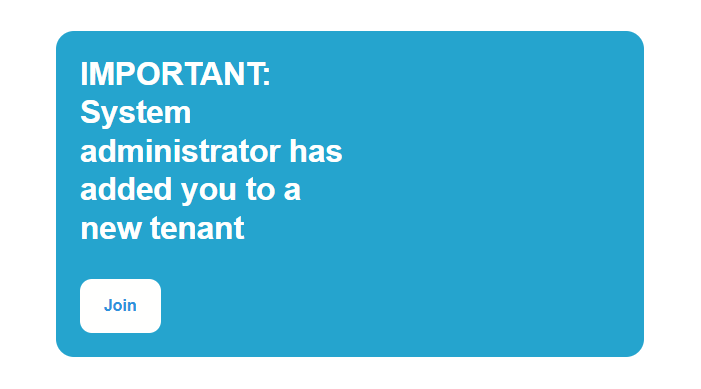
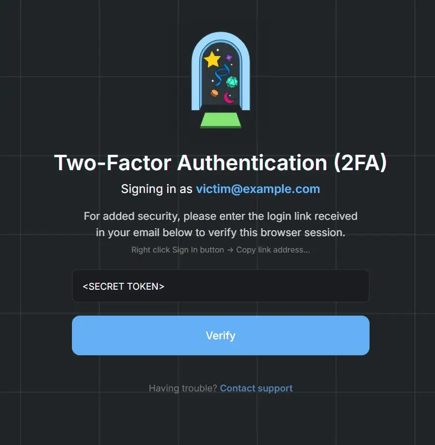

## Executive Summary

During a security assessment of a multi-tenant enterprise SaaS platform, I identified an exploitation chain enabling full account takeover through the interaction of three independent weaknesses:

1. Identity context spoofing in system-generated invitations  
2. Stored XHTML injection via unsanitized SVG uploads  
3. Persistent authorization to tenant assets after membership revocation  

When chained, these issues allow attacker-controlled authentication UI to be hosted on trusted first-party infrastructure and remain accessible even after the victim’s tenant access is revoked — creating a stealth credential interception scenario.

---

## Stage 1 — Identity Context Spoofing

The platform’s invitation system generated automated emails using user-controlled profile attributes.

Because certain security-sensitive keywords were not restricted, invitation emails could be issued under highly trusted administrative contexts. For example, an attacker can set their first name to a value such as `IMPORTANT: System administrator`, causing the victim to receive an invitation email reading:  
_"IMPORTANT: System administrator has invited you to join &lt;tenant name&gt;"_

This established initial trust without requiring domain spoofing or external phishing infrastructure.

---

## Stage 2 — Stored SVG UI Redressing

The platform permitted SVG uploads for tenant branding.

While script execution was filtered, the `<foreignObject>` element was not sanitized, allowing arbitrary XHTML content to render within the SVG canvas.

This enabled the construction of a pixel-perfect authentication verification UI hosted on a trusted platform subdomain.

Because the Content Security Policy lacked a restrictive `form-action` directive, the embedded form could submit user input to attacker-controlled endpoints.

**Security implication:** The attacker can render credential-harvesting UI inside the platform’s own origin trust boundary.

---

## Stage 3 — Authorization Persistence (“Ghost Authorization”)

A separate authorization flaw existed in tenant membership lifecycle handling.

### Observed behavior

1. Victim joins attacker tenant  
2. Victim session becomes authorized to tenant private assets  
3. Victim is removed from tenant  
4. Tenant UI access is revoked  
5. Direct asset URLs remain accessible  

This created a residual authorization state in which attacker-hosted SVG content remained reachable despite membership revocation.

The victim appeared fully removed from the tenant, yet attacker resources persisted.

---

## Full Exploitation Chain

The complete attack sequence is as follows:

1. Attacker sets his first name to a trusted security context  
2. Attacker uploads malicious SVG payload, hosted on platform's subdomain  
3. Victim receives legitimate system invitation initiated by the hacker  
4. Victim joins attacker tenant (membership events are visible to the tenant owner)  
5. Attacker immediately removes the victim from the tenant  
6. Attacker lures the victim to open the SVG via a direct link on the trusted origin’s subdomain, relying on the persisted asset authorization
7. Embedded tracking pixel signals victim presence  
8. Attacker triggers delivery of a legitimate One-Time Login link  
9. Victim submits the login link into the spoofed verification UI and is immediately redirected to the legitimate platform dashboard
10. Attacker replays the authentication artifact to establish session access  

> All interactions occur within trusted first-party infrastructure.
No external phishing domains are required.

---

## Architectural Risk Analysis

This chain exposes a broader design risk:

When platforms allow user-supplied content to render within trusted origins, UI authenticity becomes a security boundary.

If authentication workflows can be visually replicated within that same origin — and authorization revocation is incomplete — credential interception becomes feasible without leaving the platform’s trust perimeter.

---

## Remediation Considerations

Mitigations for this class of issue include:

- Sanitizing or disallowing `<foreignObject>` in SVG uploads  
- Enforcing immediate authorization revocation across asset layers  
- Restricting security-sensitive identity strings  
- Implementing restrictive `form-action` CSP directives  
- Isolating user-hosted content on separate origins  

---

## Disclosure Note

These findings were responsibly disclosed to the affected vendor.

Technical details, payloads, and operational tooling have been intentionally abstracted to focus on architectural security lessons while avoiding exploit enablement.

---

## Closing Thoughts

Origin trust is one of the strongest security signals users rely on.

When attacker-controlled UI can coexist within that trust boundary — especially alongside incomplete authorization revocation — authentication flows themselves can become interception surfaces.

Understanding and defending against these cross-layer interactions is critical for securing modern multi-tenant platforms.

If you’d like to discuss this research or related security topics, you can reach me on [LinkedIn](https://www.linkedin.com/in/rony-utevsky/).